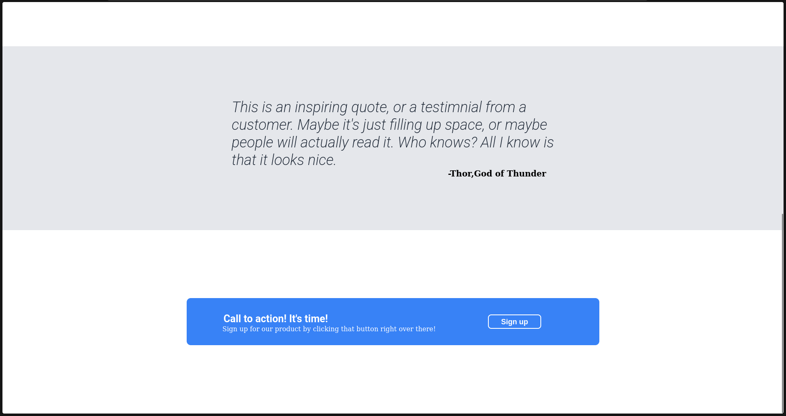

# Simple HTML & CSS Design

A simple webpage design using HTML and CSS.

## 📸 Design Preview

### Design 1:


### Design 2:


---

## 📥 How to Clone and Use

### 1️⃣ Clone the Repository
Run the following command in your terminal:

```bash
git clone https://github.com/Amir-Shaban32/Simple-HTML-CSS-design.git

